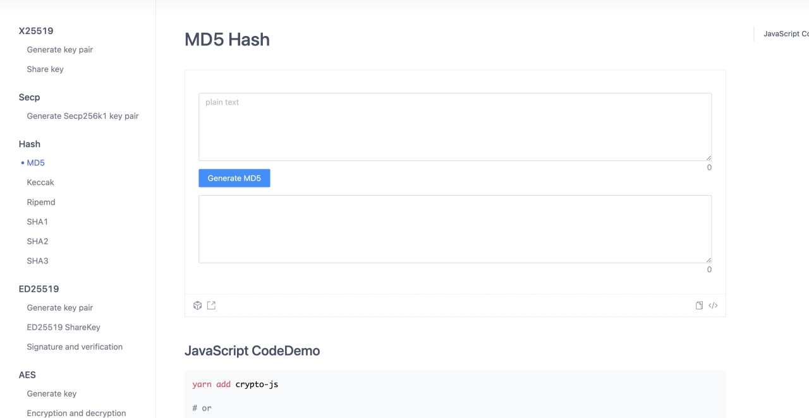

# 毕业设计：密码算法学习平台

## 研究背景

密码学理论学习对于学习者来说存在抽象理解的困难。

学习者需要理解各种密码算法类型的思想、原理和实现，但传统的学习方式可能无法很好地展示密码操作过程，导致学习者难以掌握密码学算法和知识。

本研究计划设计和实现一个基于WEB技术的密码算法学习平台，通过该平台可以更好地帮助学习者掌握密码学算法和知识。通过本课题可以学习、实践信息加密的相关算法，为将来的工作和学习打下基础。同时课题成果也能给学弟学妹借鉴学习。

## 研究目标

1. 实现各种密码算法的封装，包括古典密码、现代对称密码算法、现代公钥密码算法、数字签名算法、HASH函数、国产密码算法、密钥管理协议等。
2. 本研究的主要目标是实现各种密码算法的封装，包括古典密码、现代对称密码算法、现代公钥密码算法、数字签名算法、HASH函数、国产密码算法、密钥管理协议等。

## 主要研究内容

主要研究内容包括：

1. 古典密码算法实现。如凯撒密码、Playfair密码等。
2. 现代对称密码算法实现。如DES、3-des,AES等。
3. 传统公钥密码算法实现。如RSA、X25519、Secp256k1、Ed25519等。
4. HASH函数算法实现。如MD5、Keccak、Ripemd、SHA1、SHA2、SHA3等。
5. 国产算法系列实现。如SM2、SM3、SM4等。
6. 密码协议实现。如X509证书等

## 创新点

1. 基于WEB技术的实验实践平台
   - 通过设计和实现基于WEB技术的实验实践平台，将密码学算法的学习与实践相结合。这样的平台可以提供更直观、形象化的展示和操作方式，帮助学习者更好地理解密码学算法的思想和原理。
2. 综合性的密码算法封装实现
   - 该研究不仅涵盖了古典密码、现代对称密码算法和现代公钥密码算法等传统算法，还包括数字签名算法、HASH函数、MAC函数、密钥管理协议等多个方面。通过综合性的研究内容，提供了一个全面的密码学算法学习平台，帮助学习者全面掌握密码学知识。
3. 基于WEB技术的实验实践平台
   - 通过设计和实现基于WEB技术的实验实践平台，将密码学算法的学习与实践相结合。这样的平台可以提供更直观、形象化的展示和操作方式，帮助学习者更好地理解密码学算法的思想和原理。
4. 综合性的密码算法封装实现
   - 该研究不仅涵盖了古典密码、现代对称密码算法和现代公钥密码算法等传统算法，还包括数字签名算法、HASH函数、MAC函数、密钥管理协议等多个方面。通过综合性的研究内容，提供了一个全面的密码学算法学习平台，帮助学习者全面掌握密码学知识。

